# BeoRadio Scrobbler 🎵

## Problem Statement

When Spotify released **Wrapped** for the first time, I was beaten in minutes listened to music by far by my friends.  

But, I was actually listening to music on the radio all day long.  

That left me wondering: *How do I track my music listening record besides Spotify?* I liked the idea of analyzing my listening behaviour, but I had heard of scrobblers and never felt the urge to connect to [Last.fm](https://www.last.fm/).  

Every year since, when a new Wrapped is published, I have to think again about my "problem".

---

## Timeline 🗓️

```mermaid
timeline
    title Project Development Journey
    
    section Initial Idea
        Spotify Wrapped Released : Idea born
                                  : Get radio tracks to Spotify?
                                  : Run songs on headless system?
                                  : ...what a waste of energy 💡
    
    section December 2025
        Dec 23rd : Lying in bed googling stuff
                 : Wrapped haunting me again
                 : Musical age: 66 years
                 : Behind friends in minutes
                 : Losing street credibility 😢
        
        Dec 24th : Starting tests on Christmas Eve
                 : Working better than expected! 🎄
                 : API understood
                 : Getting artist and title info
                 : First scrobble with pylast
                 : All work done by pylast library
        
        Dec 25th : Kids playing with new toys
                 : Scrobbling works! 🎁
                 : Minor flaws fixed
                 : Exception handling added
                 : Local work complete
                 : Next: Docker, then Unraid
        
        Dec 26th-30th : Dockerfile creation
                      : Publishing to Docker Hub
                      : GitHub Actions setup
                      : Much harder than the code! 🐳
```

> **Alternative Timeline View:**
> 
> - **🌟 Initial Idea** → When was Wrapped released the first time!? Idea was born: Get Radio tracks to Spotify, run the Songs on a headless system...what a waste of energy.
> - **📅 Dec 23, 2025** → Lying in bed googling stuff...Wrapped is asking me again, since my "musical age" is 66. I am again far behind my friends in minutes spent with music, which is unfair, because I am listening to super good stuff all the time, but it is unrecognized, unrecorded...I am losing street credibility.
> - **🎄 Dec 24, 2025** → Starting with some tests while everyone is getting ready for Christmas Eve, working better than expected! API is understood and workflow is getting artist and title information. First scrobble is placed with [pylast](https://github.com/pylast/pylast) library. No efforts for me, all the work done by pylast. Time saved.
> - **🎁 Dec 25, 2025** → While the kids are playing with their new toys, scrobbling works with some minor (?) flaws. Code needs to wait here for a second and adding exceptions there is doing the trick. Locally my work is done, next step docker, then unraid.
> - **🐳 Dec 26-30, 2025** → Dockerfile, publishing to [Docker Hub](https://hub.docker.com/), using DHI, getting GitHub Actions working properly, makes me forget how easy the first part was.

---

## Documentation 📚

For more detailed information, check out these documentation files:

- **[Run Modes](docs/RUN_MODE.md)** - Different operation modes (production, detect, detect_smpl, notify_me)
- **[Feature Requests](docs/FEATURE_REQUEST.md)** - Planned features and how to contribute
- **[How-Tos](docs/HowTos.md)** - Guides and tutorials for common tasks

---

## Credits & Acknowledgments

This work relies on several amazing tools and resources:

- **Initial proof of work** written using `requests` and `pylast`
- **[pylast](https://github.com/pylast/pylast)** - Python library for Last.fm scrobbling
- **[BeoNetRemote Client API](https://support.bang-olufsen.com/hc/en-us/articles/360049859212-Drivers-for-3rd-Party-integration)** - Bang & Olufsen's API for third-party integration
  - [API Documentation](https://documenter.getpostman.com/view/1053298/T1LTe4Lt)
- **[Astral UV Docker Example](https://github.com/astral-sh/uv-docker-example)** - Dockerfile template and basic setup
- **AI Assistance:**
  - Static if-else cases improved with **Claude Sonnet 4.5**
  - Project structure modernized with **GitHub Copilot**
  - This README enhanced with **GitHub Copilot** 🤖
- **Docker:** Basic setup and minor improvements
