# BeoRadio Scrobbler 🎵

## Problem Statement

When Spotify released **Wrapped** for the first time, I was beaten in minutes listened to music by far by my friends.  

But, I was actually listening to music on the radio all day long.  

That left me wondering: *How do I track my music listening record besides Spotify?* I liked the idea of analyzing my listening behaviour, but I had heard of scrobblers and never felt the urge to connect to [Last.fm](https://www.last.fm/).  

Every year since, when a new Wrapped is published, I have to think again about my "problem".

---

## Timeline 🗓️

```mermaid
timeline
    title Project Development Journey
    
    section Initial Idea
        Spotify Wrapped Released : Idea born
                                  : Get radio tracks to Spotify?
                                  : Run songs on headless system?
                                  : ...what a waste of energy 💡
    
    section December 2025
        Dec 23rd : Lying in bed googling stuff
                 : Wrapped haunting me again
                 : Musical age: 66 years
                 : Behind friends in minutes
                 : Losing street credibility 😢
        
        Dec 24th : Starting tests on Christmas Eve
                 : Working better than expected! 🎄
                 : API understood
                 : Getting artist and title info
                 : First scrobble with pylast
                 : All work done by pylast library
        
        Dec 25th : Kids playing with new toys
                 : Scrobbling works! 🎁
                 : Minor flaws fixed
                 : Exception handling added
                 : Local work complete
                 : Next: Docker, then Unraid
        
        Dec 26th-30th : Dockerfile creation
                      : Publishing to Docker Hub
                      : GitHub Actions setup
                      : Much harder than the code! 🐳
```



> **Alternative Timeline View:**
> 
> - **🌟 Initial Idea** → When was Wrapped released the first time!? Idea was born: Get Radio tracks to Spotify, run the Songs on a headless system...what a waste of energy.
> - **📅 Dec 23, 2025** → Lying in bed googling stuff...Wrapped is asking me again, since my "musical age" is 66. I am again far behind my friends in minutes spent with music, which is unfair, because I am listening to super good stuff all the time, but it is unrecognized, unrecorded...I am losing street credibility.
> - **🎄 Dec 24, 2025** → Starting with some tests while everyone is getting ready for Christmas Eve, working better than expected! API is understood and workflow is getting artist and title information. First scrobble is placed with [pylast](https://github.com/pylast/pylast) library. No efforts for me, all the work done by pylast. Time saved.
> - **🎁 Dec 25, 2025** → While the kids are playing with their new toys, scrobbling works with some minor (?) flaws. Code needs to wait here for a second and adding exceptions there is doing the trick. Locally my work is done, next step docker, then unraid.
> - **🐳 Dec 26-30, 2025** → Dockerfile, publishing to [Docker Hub](https://hub.docker.com/), using DHI, getting GitHub Actions working properly, makes me forget how easy the first part was.

---


## Installation

This installation guide is provided to you by github copilot:

# Installation Guide - BEO Radio Scrobbler

This guide covers two methods to install and run the BEO Radio Scrobbler:  using `uv` (modern Python package manager) or running as a Docker container.

## Prerequisites

- Python 3.11 or higher (for uv installation)
- Docker (for Docker installation)
- Last.fm account with API credentials
- Bang & Olufsen device on your network

## Method 1: Installation with uv

[uv](https://github.com/astral-sh/uv) is a fast Python package installer and resolver.

### Step 1: Install uv

```bash
# On macOS and Linux
curl -LsSf https://astral.sh/uv/install.sh | sh

# On Windows
powershell -c "irm https://astral.sh/uv/install.ps1 | iex"
```

### Step 2: Clone the Repository

```bash
git clone https://github.com/CaptainPimpJr/beo_radio_scrobbler.git
cd beo_radio_scrobbler
```

### Step 3: Create Environment Variables

Create a `.env` file in `appdata/config/`:

```bash
# . env file
LASTFM_API_KEY=your_lastfm_api_key
LASTFM_API_SECRET=your_lastfm_api_secret
LASTFM_USERNAME=your_lastfm_username
LASTFM_PASSWORD=your_lastfm_password
LOCAL_TIMEZONE=Europe/Berlin
RUN_MODE=production
BEO_IP=192.168.1.100
LOGLEVEL=INFO
```

**Environment Variables Explained:**
- `LASTFM_API_KEY`: Your Last.fm API key (get from https://www.last.fm/api/account/create)
- `LASTFM_API_SECRET`: Your Last.fm API secret
- `LASTFM_USERNAME`: Your Last.fm username
- `LASTFM_PASSWORD`: Your Last.fm password
- `LOCAL_TIMEZONE`: Your timezone (e.g., `UTC`, `Europe/Berlin`, `America/New_York`)
- `RUN_MODE`: Operation mode (`production`, `detect`, `detect_smpl`, or `notify_me`)
- `BEO_IP`: IP address of your Bang & Olufsen device
- `LOGLEVEL`: Logging level (`DEBUG`, `INFO`, `WARNING`, `ERROR`)

### Step 4: Sync Dependencies

```bash
uv sync
```

This will create a virtual environment and install all dependencies. 

### Step 5: Run the Application

```bash
# Activate the virtual environment
source .venv/bin/activate  # On Linux/macOS
# or
. venv\Scripts\activate  # On Windows

# Run the scrobbler
python -m beo_radio_scrobbler

# Or use the CLI entry point
beo-radio-scrobbler
```

### Step 6: Run as a Background Service (Optional)

For Linux systems with systemd, create a service file:

```bash
sudo nano /etc/systemd/system/beo-radio-scrobbler.service
```

Add the following content (adjust paths):

```ini
[Unit]
Description=BEO Radio Scrobbler
After=network.target

[Service]
Type=simple
User=your_username
WorkingDirectory=/path/to/beo_radio_scrobbler
Environment="PATH=/path/to/beo_radio_scrobbler/. venv/bin"
ExecStart=/path/to/beo_radio_scrobbler/.venv/bin/python -m beo_radio_scrobbler
Restart=always
RestartSec=10

[Install]
WantedBy=multi-user.target
```

Enable and start the service: 

```bash
sudo systemctl daemon-reload
sudo systemctl enable beo-radio-scrobbler
sudo systemctl start beo-radio-scrobbler
sudo systemctl status beo-radio-scrobbler
```

---

## Method 2: Docker Installation

### Step 1: Clone the Repository

```bash
git clone https://github.com/CaptainPimpJr/beo_radio_scrobbler.git
cd beo_radio_scrobbler
```

### Step 2: Build the Docker Image

```bash
docker build -t beo-radio-scrobbler .
```

### Step 3: Run the Container

#### Option A: Using Environment Variables

```bash
docker run -d \
  --name beo-radio-scrobbler \
  --restart unless-stopped \
  -e LASTFM_API_KEY=your_lastfm_api_key \
  -e LASTFM_API_SECRET=your_lastfm_api_secret \
  -e LASTFM_USERNAME=your_lastfm_username \
  -e LASTFM_PASSWORD=your_lastfm_password \
  -e LOCAL_TIMEZONE=Europe/Berlin \
  -e RUN_MODE=production \
  -e BEO_IP=192.168.1.100 \
  -e LOGLEVEL=INFO \
  -v $(pwd)/appdata:/app/appdata \
  beo-radio-scrobbler
```

#### Option B: Using Docker Compose

Create a `docker-compose.yml` file:

```yaml
version: '3.8'

services:
  beo-radio-scrobbler:
    build: .
    container_name: beo-radio-scrobbler
    restart: unless-stopped
    environment:
      - LASTFM_API_KEY=your_lastfm_api_key
      - LASTFM_API_SECRET=your_lastfm_api_secret
      - LASTFM_USERNAME=your_lastfm_username
      - LASTFM_PASSWORD=your_lastfm_password
      - LOCAL_TIMEZONE=Europe/Berlin
      - RUN_MODE=production
      - BEO_IP=192.168.1.100
      - LOGLEVEL=INFO
    volumes: 
      - ./appdata:/app/appdata
    network_mode: host  # Required to access local network devices
```


#### Option A+ & B+: .env. in config folder

Create a `.env` file (instructions above) and place it inside `appdata/config/`. Where `appdata/` is defined by '-v' of 'OPTION A' or `volumes` of 'OPTION B'


Then run:

```bash
docker-compose up -d
```

### Step 4: View Logs

```bash
# Docker run
docker logs -f beo-radio-scrobbler

# Docker Compose
docker-compose logs -f
```

Or check `logs` folder. 

### Step 5: Stop the Container

```bash
# Docker run
docker stop beo-radio-scrobbler

# Docker Compose
docker-compose down
```

---

## Run Modes

The `RUN_MODE` environment variable controls how the application behaves:

- **`production`**: Continuously scrobbles tracks to Last.fm (recommended for 24/7 operation)
- **`detect`**: Detects one track and exits (useful for testing)
- **`notify_me`**: Notification mode for debugging

---

## Log Files

Logs are stored in the `appdata/logs/` directory:

- `log_radio_scrobbler.log`: Main application log (rotated daily, kept for 7 days)
- `log_scrobbles.log`: Scrobble history (production mode, kept for 5 years)
- `log_detections.log`: Detection log (detect modes, kept for 1 week)
- `log_notifications.log`: Notification log (notify_me mode, kept for 7 days)

---

## Troubleshooting

### Can't Find Bang & Olufsen Device

- Ensure your device is powered on and connected to the network
- Verify the IP address in your environment variables
- Check that your Docker container has `network_mode: host` (for Docker)

### Authentication Errors with Last.fm

- Verify your API credentials are correct
- Check that you've created an API account at https://www.last.fm/api/account/create

### Application Exits Immediately

- Check the logs in `appdata/logs/log_radio_scrobbler.log`
- Ensure all required environment variables are set
- Verify your `RUN_MODE` setting (use `production` for continuous operation)

---

## Unraid Installation (Coming Soon)

Docker installation on Unraid will be supported through Community Applications once the project is published.


---


## Documentation 📚

For more detailed information, check out these documentation files:

- **[Run Modes](docs/RUN_MODE.md)** - Different operation modes (production, detect, detect_smpl, notify_me)
- **[Feature Requests](docs/FEATURE_REQUEST.md)** - Planned features and how to contribute
- **[How-Tos](docs/HowTos.md)** - Guides and tutorials for common tasks

---

## Credits & Acknowledgments

- **Initial proof of work** written using `requests` and `pylast` 

### Third Party Libraries used:
- **[pylast](https://github.com/pylast/pylast)** - Python library for Last.fm scrobbling
- **[BeoNetRemote Client API](https://support.bang-olufsen.com/hc/en-us/articles/360049859212-Drivers-for-3rd-Party-integration)** - Bang & Olufsen's API for third-party integration
  - [API Documentation](https://documenter.getpostman.com/view/1053298/T1LTe4Lt)
- **[uv](https://github.com/astral-sh/uv)** - An extremely fast Python package installer and resolver
- **[Astral UV Docker Example](https://github.com/astral-sh/uv-docker-example)** - Dockerfile template and basic setup
- **[python-dotenv](https://github.com/theskumar/python-dotenv)** - loading .env file
- **[Arrow](https://github.com/arrow-py/arrow)** (Apache 2.0) - Better dates and times for Python
- **[Loguru](https://github.com/Delgan/loguru)** (MIT) - Python logging made simple
- **[Pydantic](https://github.com/pydantic/pydantic)** (MIT) - Data validation using Python type hints
- **[Requests](https://github.com/psf/requests)** (Apache 2.0) - HTTP library for Python
- **[PyYAML](https://github.com/yaml/pyyaml)** (MIT) - YAML parser and emitter for Python

- **AI Assistance:**
  - Static if-else cases improved with **Claude Sonnet 4.5**
  - Project structure modernized with **GitHub Copilot**
  - This README enhanced with **GitHub Copilot** 🤖


## Supported Devices

Copied from B&O documentation ([B&O 3rd Party Integration](https://support.bang-olufsen.com/hc/en-us/articles/360049859212-Drivers-for-3rd-Party-integration)):  

Bang & Olufsen Audio Systems:
Beosound Stage
Beosound 35
Beosound Essence 2nd Gen
Beosound Core
Beosound Shape
Beosound Edge
Beosound 1 1st / 2nd Gen
Beosound 2 1st / 2nd Gen
Beolink Converter NL/ML
Beoplay A9 2nd / 3rd / 4th Gen
Beoplay A6
Beoplay M5
Beoplay M3


Bang & Olufsen Active Loudspeakers:
BeoLab 90
BeoLab 50

## Mozart API - recent Bang & Olufsen Models

I do not think I want to add a "Buy me a ~~coffee~~ new B&O Speaker"-Button.  
But if you insist on supporting with a replacement for my Beosound 1, open an issue in github...  
I will add Mozart API as soon as I have replaced my Beosound 1 (which is not planned), or I have access to a Mozart API supporting device. 